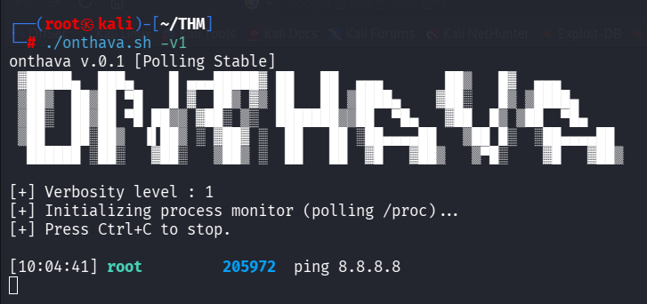

# onthava

**Real-time process spawn monitor for Linux**



---

## Overview

`onthava` is a lightweight Bash tool that polls `/proc` every 0.1 seconds to detect newly spawned processes and prints them in a structured `time / user / PID / command` format.

> Note: `inotifywait` does not work on virtual filesystems like `/proc`.  
> onthava works around this limitation using a direct polling approach.

---

## Features

- Only captures processes spawned **after** the tool starts — ignores pre-existing ones
- Adjustable noise filtering via `-v` flag (levels 1–3)
- Automatically filters kernel threads (`kworker`, `ksoftirqd`, `rcu_*`, etc.)
- Color-coded output: timestamp, user, PID, and full command with arguments
- Fast duplicate PID detection using an associative array
- Periodic cleanup of terminated PIDs to prevent memory bloat

---

## Usage

```bash
wget https://raw.githubusercontent.com/pythava/Onthava/refs/heads/main/onthava.sh
chmod +x onthava.sh
./onthava.sh
```

### Options

```
-v 1   Quiet mode   — aggressive filtering (systemd, vpnip.sh, sessionclean, etc.)
-v 2   Default mode — filters systemd and systemd-userwork (default)
-v 3   Verbose mode — minimal filtering, shows nearly all new processes
```

### Examples

```bash
sudo ./onthava.sh          # default (level 2)
sudo ./onthava.sh -v 1     # quiet mode
sudo ./onthava.sh -v 3     # verbose mode
```

---

## Output Format

```
[HH:MM:SS] <user>         <PID>    <command + args>
```

```
[14:32:01] root          12345    /usr/bin/python3 /opt/script.py
[14:32:02] www-data      12346    nginx: worker process
[14:32:03] alice         12347    bash -c whoami
```

---

## Filter Levels

| Level  | Filtered patterns |
|--------|-------------------|
| Common | `onthava`, `kworker`, `ksoftirqd`, `rcu_*`, `migration` |
| `-v 1` | Common + `systemd`, `systemd-userwork`, `vpnip.sh`, `sessionclean`, `defunct` |
| `-v 2` | Common + `systemd`, `systemd-userwork` |
| `-v 3` | Common only |

---

## Requirements

| Item         | Details |
|--------------|---------|
| OS           | Linux (Ubuntu, Debian, Arch, etc.) |
| Privileges   | `root` or `sudo` recommended |
| Dependencies | `bash 4.0+`, `ps`, `tr`, `date` — all standard |

---

---

## Changelog

| Version | Notes |
|---------|-------|
| v0.1    | Initial release — /proc polling, verbosity levels, PID tracking |

---

## Caveats

- Detection has an inherent ~0.1s delay due to polling.
- Very short-lived processes may be missed between poll cycles.
- For true real-time detection, consider [execsnoop](https://github.com/brendangregg/perf-tools) or `auditd`.

---

## License
there's no License FREEEEEEEEEEEEEEEEEEEEEE
